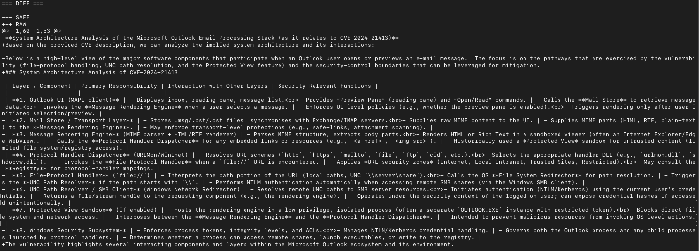

## DualMindDiffAI

git clone https://github.com/3MPER0RR/DualMindDiffAI.git

cd DualMindDiff

python3 -m venv venv
source venv/bin/activate

pip install requests, python-dotenv

## Usage e configure

insert a sample.txt in data/

export OLLAMA_API_KEY="api_key"

export OLLAMA_BASE_URL="https://ollama.com"

export GOOGLE_API_KEY="api_key"

## edit model e prompt in main.py

run(
    prompt="Analyze the content in the document.",
    file_path="data/sample.txt",
    safe_llm_mode="ollama-cloud",
    safe_model="gemma4:31b-cloud",
    raw_llm_mode="google",
    raw_model="gemini-2.5-flash"
)

python3 main.py

## output 

=== SAFE ===
[filtered analysis from the first model]

=== RAW ===
[raw analysis from the second model]

=== DIFF ===
[reasoning differences between the two models]

es CVE-2024-21413

